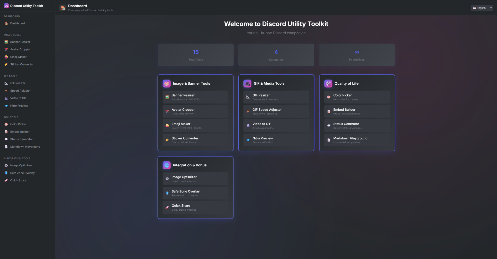

# Discord Utility Toolkit


A comprehensive web-based toolkit with utilities for Discord creators and power users. Built with React and Vite, this application provides a beautiful, modern interface for creating, optimizing, and managing Discord content with ease.

## ✨ Features

### 🎨 Image & Banner Tools
- **Banner Resizer** - Resize images to Discord banner format (600×240)
- **Avatar Cropper** - Crop images for Discord profile pictures with interactive selection
- **Emoji Maker** - Create Discord emojis (128×128, <256KB) with automatic optimization
- **Sticker Converter** - Convert images to Discord sticker format

### 🌀 GIF & Media Tools
- **GIF Resizer** - Downscale and compress GIFs for Discord file limits
- **GIF Speed Adjuster** - Adjust GIF animation speed with real-time preview
- **Video to GIF** - Convert video clips to Discord-friendly GIFs
- **Nitro Preview** - Preview animations as if you had Discord Nitro

### ⚡ Quality of Life Tools
- **Color Picker** - Pick colors for Discord themes and embeds with hex codes
- **Embed Builder** - Create Discord embeds with live preview and JSON export
- **Status Generator** - Generate custom Discord status messages
- **Markdown Playground** - Test Discord markdown formatting with live preview

### 🛠️ Integration & Bonus Tools
- **Image Optimizer** - Optimize images for Discord file size limits
- **Safe Zone Overlay** - Preview banners with Discord UI overlay
- **Quick Share** - Quickly compress and share images to clipboard

## 📸 Screenshots


*Main dashboard with all available tools*

## 🚀 Getting Started

### Prerequisites

- **Node.js** v16 or higher
- **npm** or **yarn** package manager

### Installation

1. **Clone the repository**
   ```bash
   git clone https://github.com/goonernator/discord-utility-toolkit.git
   cd discord-utility-toolkit
   ```

2. **Install dependencies**
   ```bash
   npm install
   # or
   yarn install
   ```

3. **Start the development server**
   ```bash
   npm run dev
   # or
   yarn dev
   ```

4. **Open your browser**
   Navigate to `http://localhost:3000` to start using the toolkit.

### Production Build

```bash
# Build for production
npm run build

# Preview the production build
npm run preview
```

## 🏗️ Project Structure

```
src/
├── components/
│   ├── ImageTools/          # Image processing tools
│   ├── GifTools/            # GIF and media tools
│   ├── QolTools/            # Quality of life tools
│   ├── IntegrationTools/    # Integration and bonus tools
│   ├── Dashboard.js         # Main dashboard
│   ├── Header.js            # Application header
│   └── Sidebar.js           # Navigation sidebar
├── i18n.js                  # Internationalization setup
├── index.css                # Global styles
└── App.js                   # Main application component
```

## 🌐 Multi-language Support

The application supports multiple languages:
- 🇺🇸 English
- 🇪🇸 Spanish
- 🇫🇷 French
- 🇩🇪 German

## 📱 Responsive Design

Fully responsive design that works on:
- Desktop computers
- Tablets
- Mobile devices

## 📂 Tech Stack

- **Frontend Framework**: React 18.2.0
- **Build Tool**: Vite 4.3.2
- **Styling**: styled-components
- **Routing**: React Router DOM
- **Image Processing**: browser-image-compression
- **Video Processing**: FFmpeg.wasm
- **File Handling**: react-dropzone
- **Internationalization**: react-i18next
- **Color Picker**: react-color

## 🎨 Design System

The application uses Discord's official color palette and design principles:
- Discord Blurple (#5865F2)
- Discord Green (#57F287)
- Discord Fuchsia (#EB459E)
- Dark theme with proper contrast ratios
- Smooth animations and transitions

### Development Workflow

1. Fork the repository
2. Create a feature branch (`git checkout -b feature/amazing-feature`)
3. Commit your changes (`git commit -m 'Add some amazing feature'`)
4. Push to the branch (`git push origin feature/amazing-feature`)
5. Open a Pull Request

## 📝 License

This project is licensed under the MIT License - see the [LICENSE](LICENSE) file for details.

## 🙏 Acknowledgments

- Discord for the amazing platform and design inspiration
- The React and Vite communities for excellent tooling
- All contributors who help make this project better


---

Made with ❤️ for the Discord community
